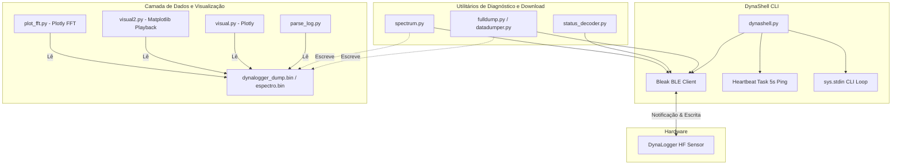

# Arquitetura do Projeto (ARCH.md)

Este documento descreve a estrutura de módulos, o fluxo de comunicação BLE e o processamento de dados do ecossistema DynaShell.

---

## 🏗️ Visão Geral do Sistema

O projeto é estruturado em scripts Python executáveis de finalidade única e um shell interativo principal. Ele faz a ponte entre o protocolo de hardware proprietário (BLE) e os arquivos binários locais de dados, permitindo processamento matemático e exibição visual.



---

## 📦 Componentes de Software

### 1. Camada de Comunicação BLE e Controle
* **[dynashell.py](file:///c:/Projetos/Dynalogger/dynashell.py)**: Centraliza as funcionalidades. Fornece uma CLI interativa assíncrona. Mantém um loop de escuta e tarefas em segundo plano (como o heartbeat de 5 segundos para evitar timeouts de desconexão).
* **[service.py](file:///c:/Projetos/Dynalogger/service.py)**: Utilitário para escanear serviços e características GATT expostas pelo dispositivo Bluetooth.
* **[explorer.py](file:///c:/Projetos/Dynalogger/explorer.py)**: Mapeia UUIDs do sensor com nomes legíveis inferidos a partir do ecossistema Dynamox (ex: `DATA_EXCHANGE_RX`, `TEMPERATURE_CURRENT`, etc.).
* **[commands.py](file:///c:/Projetos/Dynalogger/commands.py)** / **[fuzzing.py](file:///c:/Projetos/Dynalogger/fuzzing.py)** / **[unlocker.py](file:///c:/Projetos/Dynalogger/unlocker.py)**: Scripts auxiliares de desenvolvimento e diagnóstico para mapeamento/fuzzing de comandos hexadecimais de baixo nível.

### 2. Camada de Extração (Dumper)
* **[fulldump.py](file:///c:/Projetos/Dynalogger/fulldump.py)** (e seu predecessor [datadumper.py](file:///c:/Projetos/Dynalogger/datadumper.py)): Implementa o download sequencial paginado da memória Flash do sensor.
* **[spectrum.py](file:///c:/Projetos/Dynalogger/spectrum.py)**: Dispara a aquisição de FFT no sensor (usando o comando `0x37`) e gerencia a leitura do buffer de espectro bruto.

### 3. Camada de Decodificação e Processamento
* **[status_decoder.py](file:///c:/Projetos/Dynalogger/status_decoder.py)**: Decodifica o payload de 18+ bytes retornado pelo comando `0x31` (GET_STATUS) em informações de bateria, relógio interno, logs, taxa de amostragem e gatilhos de gravação.
* **[parse_log.py](file:///c:/Projetos/Dynalogger/parse_log.py)**: Decodifica registros de log de tendência (formato binário de 16 bytes contendo timestamp, temperatura e valores RMS de vibração de 3 eixos).

### 4. Camada de Visualização
* **[visual.py](file:///c:/Projetos/Dynalogger/visual.py)**: Gera uma página interativa HTML dark com Plotly (`analise_vibracao.html`) contendo as séries temporais dos eixos X, Y e Z desinterpolados a partir do arquivo `.bin`.
* **[visual2.py](file:///c:/Projetos/Dynalogger/visual2.py)**: Implementa uma janela osciloscópica deslizante com animação em tempo real a 30 FPS via Matplotlib para simular a reprodução dos dados de aceleração coletados.
* **[plot_fft.py](file:///c:/Projetos/Dynalogger/plot_fft.py)**: Plota magnitudes de frequência resultantes do download espectral.

---

## ⚡ Fluxos Assíncronos Chave

### 1. Loop do Shell (`run_shell`)
Como o shell interativo lê do terminal enquanto o Bluetooth roda de forma assíncrona, a entrada de terminal `sys.stdin.readline` é delegada a um executor assíncrono para não travar o loop do `asyncio`:
```python
line = await self.loop.run_in_executor(None, sys.stdin.readline)
```

### 2. Loop de Heartbeat (Ping)
O sensor encerra conexões ociosas muito rapidamente. O driver inicia um timer de fundo que dispara pacotes de PING (`0x38`) a cada 5 segundos se não houver transferência ativa de dados em andamento.
```python
async def _heartbeat_loop(self):
    while self.connected:
        await asyncio.sleep(5)
        if self.connected and not self.downloading:
            await self.send_command(0x38)
```
